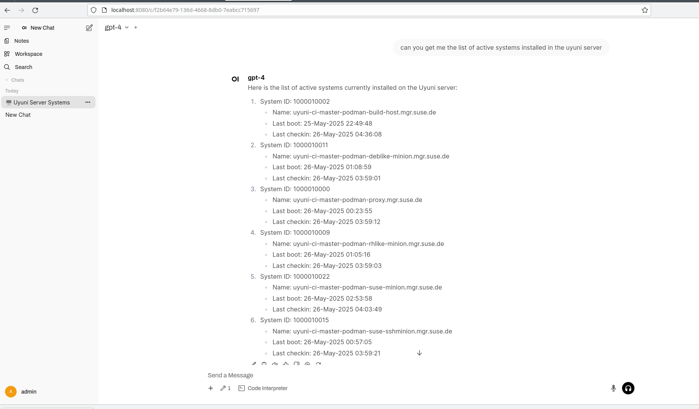
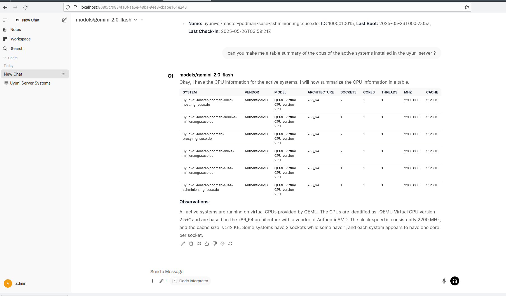

# mcp-server-uyuni

Model Context Protocol Server for Uyuni Server API.

## Tools

* get_list_of_active_systems
* get_cpu_of_a_system
* get_all_systems_cpu_info
* check_system_updates
* check_all_systems_for_updates
* schedule_apply_pending_updates_to_system
* schedule_apply_specific_update
* get_systems_needing_security_update_for_cve
* get_systems_needing_reboot
* schedule_system_reboot
* cancel_action
* list_all_scheduled_actions
* list_activation_keys

## Usage

There are two main ways to run the `mcp-server-uyuni`: using the pre-built Docker container or running it locally with `uv`. Both methods require a `credentials` file.

### Credentials File

Before running the server, you need to create a `credentials` file. You can place it anywhere, but you must provide the correct path to it when running the server.


```
UYUNI_SERVER=192.168.1.124:8443
UYUNI_USER=admin
UYUNI_PASS=admin
```

Replace the values with your Uyuni server details. **This file contains sensitive information and should not be committed to version control.**

Alternatively, you can also set environment variables instead of using a file.

## Debug with mcp inspect

You can run (docker option)

`npx @modelcontextprotocol/inspector docker run -i --rm --env-file /path/to/your/credentials ghcr.io/uyuni-project/mcp-server-uyuni:latest`

or you can run (uv option)

`npx @modelcontextprotocol/inspector uv run --env-file=.venv/credentials --directory . mcp-server-uyuni`

## Use with Open WebUI

Open WebUI is an extensible, feature-rich, and user-friendly self-hosted AI platform designed to operate entirely offline. It supports various LLM runners like Ollama and OpenAI-compatible APIs, with built-in inference engine for RAG, making it a powerful AI deployment solution. More at https://docs.openwebui.com/

### Setup Open WebUI

You need `uv` installed. See https://docs.astral.sh/uv

Start v0.6.10 (for MCP support we need a version >= 0.6.7)

```
 uv tool run open-webui@0.6.10 serve
```

Configure the OpenAI API URL by following these instructions:

https://docs.openwebui.com/getting-started/quick-start/starting-with-openai

For gemini, use the URL https://generativelanguage.googleapis.com/v1beta/openai and get the token API from the Google AI Studio https://aistudio.google.com/

### Setup Open WebUI MCP Support

First, ensure you have your `credentials` file ready as described in the Usage section.

Then, you need a `config.json` for the MCP to OpenAPI proxy server.

### Option 1: Running with Docker (Recommended)

This is the easiest method for deployment. Pre-built container images are available on the GitHub Container Registry.

 Replace `/path/to/your/credentials` with the absolute path to your `credentials` file. Replace `VERSION` with the desired release tag (e.g., `v0.2.1`) or use `latest` for the most recent build from the `main` branch.

```json
{
  "mcpServers": {
    "mcp-server-uyuni": {
      "command": "docker",
      "args": [
        "run", "-i", "--rm",
        "--env-file", "/path/to/your/credentials",
        "ghcr.io/uyuni-project/mcp-server-uyuni:VERSION"
      ]
    }
  }
}
```

Alternatively, you can use environment variables instead of a file.

```json
{
  "mcpServers": {
    "mcp-server-uyuni": {
      "command": "docker",
      "args": [
        "run", "-i", "--rm",
        "-e", "UYUNI_SERVER=192.168.1.124:8443",
        "-e", "UYUNI_USER=admin",
        "-e", "UYUNI_PASS=admin",
        "ghcr.io/uyuni-project/mcp-server-uyuni:VERSION"
      ]
    }
  }
}
```

### Option 2: Running Locally with `uv`

This method is ideal for development.

1.  **Install `uv`:** See https://docs.astral.sh/uv
2.  **Install dependencies:**
    ```bash
    uv sync
    ```
3.  Replace `/path/to/your/credentials` with the absolute path to your `credentials` file.

```json
{
  "mcpServers": {
    "mcp-server-uyuni": {
      "command": "uv",
      "args": [
        "run",
        "--env-file", "/path/to/your/credentials",
        "--directory", ".",
        "mcp-server-uyuni"
      ]
    }
  }
}
```

### Start the MCP to OpenAPI proxy server


Then, you can start the Model Context Protocol to Open API proxy server:

```
uvx mcpo --port 9000  --config ./config.json
```

### Add the tool

And then you can add the tool to the Open Web UI. See https://docs.openwebui.com/openapi-servers/open-webui#step-2-connect-tool-server-in-open-webui .  

Note the url should be http://localhost/mcp-server-uyuni as explained in https://docs.openwebui.com/openapi-servers/open-webui#-optional-using-a-config-file-with-mcpo





## Local Development Build

To build the Docker image locally for development or testing purposes:
```bash
docker build -t  mcp-server-uyuni .
```

Then, you can use `docker run -i --rm  --env-file .venv/credentials mcp-server-uyuni` at any of the mcp-client configurations explained above.

## Release Process

To create a new release for `mcp-server-uyuni`, follow these steps:

1.  **Update Documentation (`README.md`):**
    *   Ensure the list of available tools under the "## Tools" section is current and reflects all implemented tools in `srv/mcp-server-uyuni/server.py`.
    *   Review and update any screenshots in the `docs/` directory and their references in this `README.md` to reflect the latest UI or functionality, if necessary.
    *   Verify all usage instructions and examples are still accurate.
2.  **Update Manual Test Cases (`TEST_CASES.md`):**
    *   Refer to the "How to Update for a New Tag/Release" section within `TEST_CASES.md`.
    *   Add a new status column for the upcoming release version (e.g., `Status (vX.Y.Z)`).
    *   Execute all relevant manual test cases against the code to be released.
    *   Record the `Pass`, `Fail`, `Blocked`, or `N/A` status for each test case in the new version column.
3.  **Commit Changes:** Commit all the updates to `README.md`, `TEST_CASES.md`, and any other changed files.
4.  **Update version in pyproject.toml:** Use semantic versioning to set the new version.
5.  **Update CHANGELOG.md:**
    *   Generate the changelog using `conventional-changelog-cli`. If you don't have it installed globally, you can use `npx`.
    *   The command to generate the changelog using the `conventionalcommits` preset and output it to `CHANGELOG.md` (prepending the new changes) is:
        ```bash
        npx conventional-changelog-cli -p conventionalcommits -i CHANGELOG.md -s
        ```
    *   Review the generated `CHANGELOG.md` for accuracy and formatting.
    *   Commit the updated `CHANGELOG.md`.
6.  **Create Git Tag:** Create a new Git tag for the release (e.g., `git tag vX.Y.Z`). Follow [semantic versioning rules](https://semver.org/).
7.  **Push Changes and Tags:** Push your commits (including the changelog update) and the new tag to the repository (e.g., `git push && git push --tags`).
8.  **Automated Build and Push:** Pushing the tag to GitHub will automatically trigger the "Docker Publish" GitHub Action. This action builds the Docker image and pushes it to the GitHub Container Registry (`ghcr.io`) with tags for the specific version (e.g., `v0.3.0`) and major.minor (e.g., `v0.3`). Pushing to `main` will update the `latest` tag.
9.  **Test the container:** Pull the newly published image from `ghcr.io` and run the tests in `TEST_CASES.md` against it.
    `docker run -i --rm --env-file .venv/credentials ghcr.io/uyuni-project/mcp-server-uyuni:VERSION` (replace VERSION with the new tag).


## License

MIT
